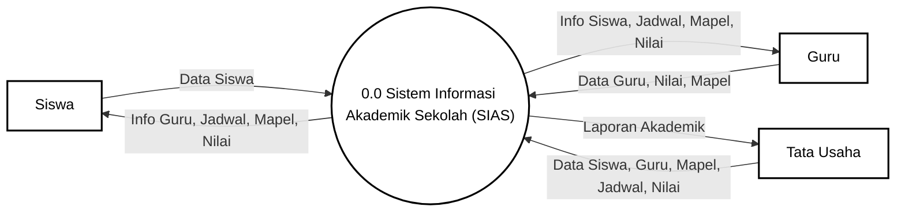

# DFD Level 0 - Sistem Informasi Akademik Sekolah (SIAS)
> **Notasi: Yourdon & DeMarco**

```mermaid
flowchart LR
    %% Entitas Eksternal (kotak persegi)
    Siswa["Siswa"]
    Guru["Guru"]
    TU["Tata Usaha"]

    %% Proses Utama (lingkaran / bubble)
    SIAS(("0.0 Sistem Informasi Akademik Sekolah (SIAS)"))

    %% Aliran Data — Siswa
    Siswa -- "Data Siswa" --> SIAS
    SIAS -- "Info Guru, Jadwal, Mapel, Nilai" --> Siswa

    %% Aliran Data — Guru
    Guru -- "Data Guru, Nilai, Mapel" --> SIAS
    SIAS -- "Info Siswa, Jadwal, Mapel, Nilai" --> Guru

    %% Aliran Data — Tata Usaha
    TU -- "Data Siswa, Guru, Mapel, Jadwal, Nilai" --> SIAS
    SIAS -- "Laporan Akademik" --> TU

    %% Styling (hitam-putih Yourdon/DeMarco)
    style Siswa fill:#fff,stroke:#000,stroke-width:2px,color:#000
    style Guru fill:#fff,stroke:#000,stroke-width:2px,color:#000
    style TU fill:#fff,stroke:#000,stroke-width:2px,color:#000
    style SIAS fill:#fff,stroke:#000,stroke-width:2px,color:#000
```
