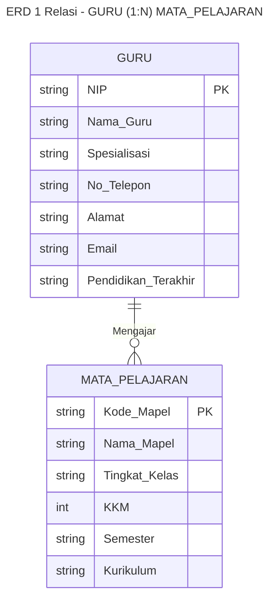

# ERD 1 Relasi - GURU (1:N) MATA_PELAJARAN

```mermaid
---
title: ERD 1 Relasi - GURU (1:N) MATA_PELAJARAN
config:
    layout: elk
---
erDiagram
    GURU {
        string NIP PK
        string Nama_Guru
        string Spesialisasi
        string No_Telepon
        string Alamat
        string Email
        string Pendidikan_Terakhir
    }

    MATA_PELAJARAN {
        string Kode_Mapel PK
        string Nama_Mapel
        string Tingkat_Kelas
        int KKM
        string Semester
        string Kurikulum
    }

    GURU ||--o{ MATA_PELAJARAN : "Mengajar"
```

> **Kardinalitas:** 1 Guru mengajar banyak Mata Pelajaran (1 : N)
