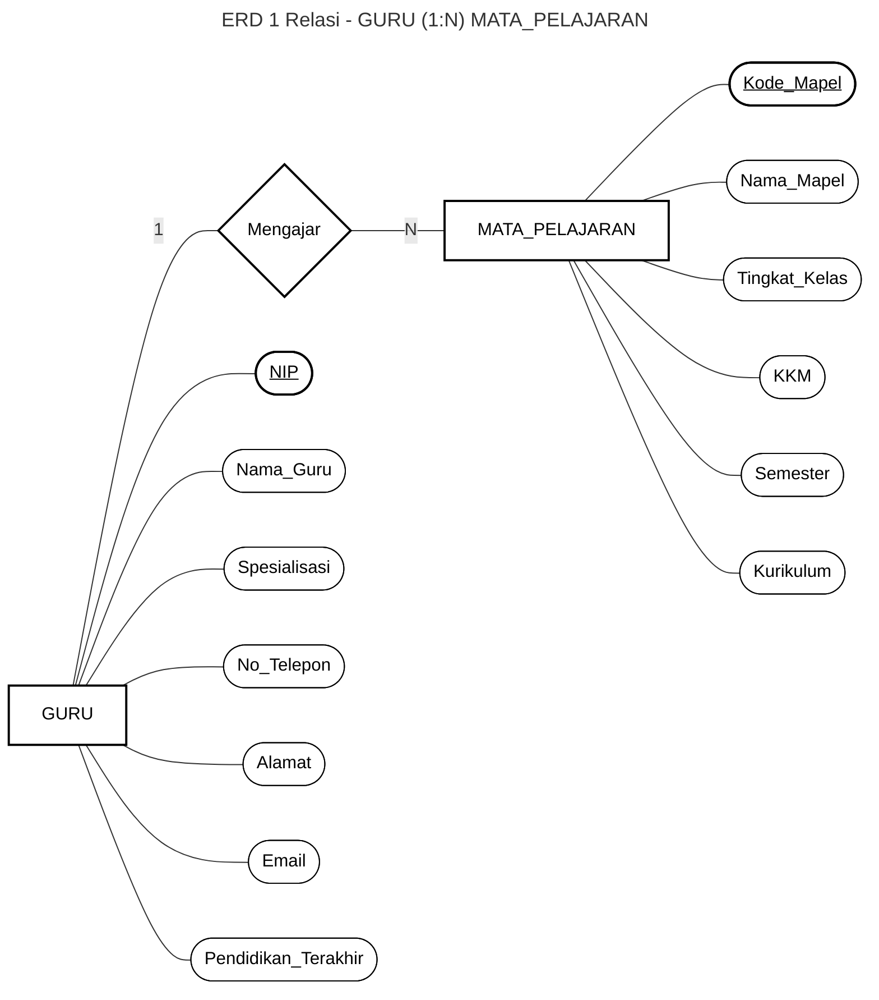

# ERD 1 Relasi - GURU (1:N) MATA_PELAJARAN

> Notasi Chen: Kotak = Entitas, Diamond = Relasi, Oval = Atribut, **Atribut PK digarisbawahi**

> **Kardinalitas:** 1 Guru mengajar banyak Mata Pelajaran (1 : N)
>
> **Legenda:** `[kotak]` = Entitas | `{diamond}` = Relasi | `([oval])` = Atribut | <u>underline</u> = Primary Key
