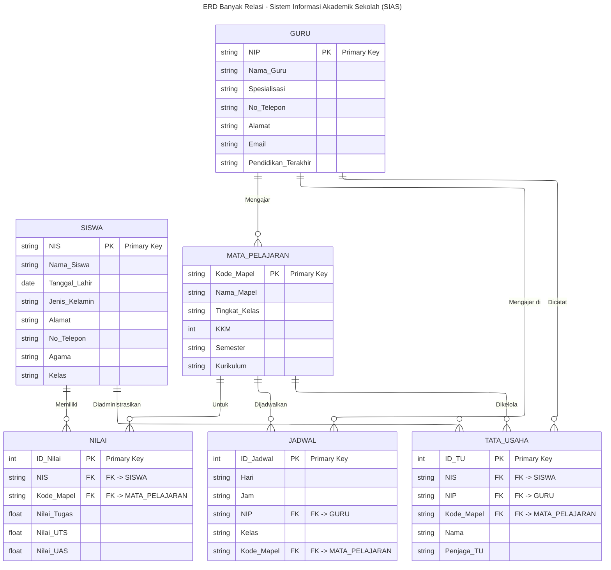

# ERD Banyak Relasi - Sistem Informasi Akademik Sekolah (SIAS)

> **Kardinalitas:**
> - GURU (1) --- (N) MATA_PELAJARAN → 1 Guru mengajar banyak Mapel
> - SISWA (M) --- (N) MATA_PELAJARAN → dipecah via tabel NILAI
> - GURU (1) --- (N) JADWAL → 1 Guru punya banyak Jadwal
> - MATA_PELAJARAN (1) --- (N) JADWAL → 1 Mapel dijadwalkan banyak kali
> - TATA_USAHA menghubungkan SISWA, GURU, MATA_PELAJARAN untuk administrasi
