# ERD Banyak Relasi - Sistem Informasi Akademik Sekolah (SIAS)

```mermaid
---
title: ERD Banyak Relasi - Sistem Informasi Akademik Sekolah (SIAS)
---

flowchart TB
    %% ════════════════════════════════════
    %% ENTITAS (Kotak)
    %% ════════════════════════════════════
    SISWA["SISWA"]
    GURU["GURU"]
    MAPEL["MATA_PELAJARAN"]
    NILAI["NILAI"]
    JADWAL["JADWAL"]
    TU["TATA_USAHA"]

    %% ════════════════════════════════════
    %% RELASI (Diamond)
    %% ════════════════════════════════════
    R1{"Mengajar"}
    R2{"Memiliki"}
    R3{"Untuk"}
    R4{"Mengajar di"}
    R5{"Dijadwalkan"}
    R6{"Diadministrasikan"}
    R7{"Dicatat"}
    R8{"Dikelola"}

    %% ════════════════════════════════════
    %% KONEKSI ENTITAS — RELASI
    %% ════════════════════════════════════
    GURU ---|"1"| R1
    R1 ---|"N"| MAPEL

    SISWA ---|"1"| R2
    R2 ---|"N"| NILAI

    MAPEL ---|"1"| R3
    R3 ---|"N"| NILAI

    GURU ---|"1"| R4
    R4 ---|"N"| JADWAL

    MAPEL ---|"1"| R5
    R5 ---|"N"| JADWAL

    SISWA ---|"1"| R6
    R6 ---|"N"| TU

    GURU ---|"1"| R7
    R7 ---|"N"| TU

    MAPEL ---|"1"| R8
    R8 ---|"N"| TU

    %% ════════════════════════════════════
    %% ATRIBUT SISWA
    %% ════════════════════════════════════
    S_NIS(["<u>NIS</u>"])
    S_Nama(["Nama_Siswa"])
    S_TglLahir(["Tanggal_Lahir"])
    S_JK(["Jenis_Kelamin"])
    S_Alamat(["Alamat"])
    S_Telp(["No_Telepon"])
    S_Agama(["Agama"])
    S_Kelas(["Kelas"])

    SISWA --- S_NIS
    SISWA --- S_Nama
    SISWA --- S_TglLahir
    SISWA --- S_JK
    SISWA --- S_Alamat
    SISWA --- S_Telp
    SISWA --- S_Agama
    SISWA --- S_Kelas

    %% ════════════════════════════════════
    %% ATRIBUT GURU
    %% ════════════════════════════════════
    G_NIP(["<u>NIP</u>"])
    G_Nama(["Nama_Guru"])
    G_Spesialisasi(["Spesialisasi"])
    G_Telp(["No_Telepon"])
    G_Alamat(["Alamat"])
    G_Email(["Email"])
    G_Pendidikan(["Pendidikan_Terakhir"])

    GURU --- G_NIP
    GURU --- G_Nama
    GURU --- G_Spesialisasi
    GURU --- G_Telp
    GURU --- G_Alamat
    GURU --- G_Email
    GURU --- G_Pendidikan

    %% ════════════════════════════════════
    %% ATRIBUT MATA_PELAJARAN
    %% ════════════════════════════════════
    M_Kode(["<u>Kode_Mapel</u>"])
    M_Nama(["Nama_Mapel"])
    M_Tingkat(["Tingkat_Kelas"])
    M_KKM(["KKM"])
    M_Semester(["Semester"])
    M_Kurikulum(["Kurikulum"])

    MAPEL --- M_Kode
    MAPEL --- M_Nama
    MAPEL --- M_Tingkat
    MAPEL --- M_KKM
    MAPEL --- M_Semester
    MAPEL --- M_Kurikulum

    %% ════════════════════════════════════
    %% ATRIBUT NILAI
    %% ════════════════════════════════════
    N_ID(["<u>ID_Nilai</u>"])
    N_NIS(["<i>NIS (FK)</i>"])
    N_Kode(["<i>Kode_Mapel (FK)</i>"])
    N_Tugas(["Nilai_Tugas"])
    N_UTS(["Nilai_UTS"])
    N_UAS(["Nilai_UAS"])

    NILAI --- N_ID
    NILAI --- N_NIS
    NILAI --- N_Kode
    NILAI --- N_Tugas
    NILAI --- N_UTS
    NILAI --- N_UAS

    %% ════════════════════════════════════
    %% ATRIBUT JADWAL
    %% ════════════════════════════════════
    J_ID(["<u>ID_Jadwal</u>"])
    J_Hari(["Hari"])
    J_Jam(["Jam"])
    J_NIP(["<i>NIP (FK)</i>"])
    J_Kelas(["Kelas"])
    J_Kode(["<i>Kode_Mapel (FK)</i>"])

    JADWAL --- J_ID
    JADWAL --- J_Hari
    JADWAL --- J_Jam
    JADWAL --- J_NIP
    JADWAL --- J_Kelas
    JADWAL --- J_Kode

    %% ════════════════════════════════════
    %% ATRIBUT TATA_USAHA
    %% ════════════════════════════════════
    T_ID(["<u>ID_TU</u>"])
    T_NIS(["<i>NIS (FK)</i>"])
    T_NIP(["<i>NIP (FK)</i>"])
    T_Kode(["<i>Kode_Mapel (FK)</i>"])
    T_Nama(["Nama"])
    T_Penjaga(["Penjaga_TU"])

    TU --- T_ID
    TU --- T_NIS
    TU --- T_NIP
    TU --- T_Kode
    TU --- T_Nama
    TU --- T_Penjaga

    %% ════════════════════════════════════
    %% STYLING
    %% ════════════════════════════════════
    style SISWA fill:#fff,stroke:#000,stroke-width:2px,color:#000
    style GURU fill:#fff,stroke:#000,stroke-width:2px,color:#000
    style MAPEL fill:#fff,stroke:#000,stroke-width:2px,color:#000
    style NILAI fill:#fff,stroke:#000,stroke-width:2px,color:#000
    style JADWAL fill:#fff,stroke:#000,stroke-width:2px,color:#000
    style TU fill:#fff,stroke:#000,stroke-width:2px,color:#000

    style R1 fill:#fff,stroke:#000,stroke-width:2px,color:#000
    style R2 fill:#fff,stroke:#000,stroke-width:2px,color:#000
    style R3 fill:#fff,stroke:#000,stroke-width:2px,color:#000
    style R4 fill:#fff,stroke:#000,stroke-width:2px,color:#000
    style R5 fill:#fff,stroke:#000,stroke-width:2px,color:#000
    style R6 fill:#fff,stroke:#000,stroke-width:2px,color:#000
    style R7 fill:#fff,stroke:#000,stroke-width:2px,color:#000
    style R8 fill:#fff,stroke:#000,stroke-width:2px,color:#000
```

> Notasi Chen: Kotak = Entitas, Diamond = Relasi, Oval = Atribut, **PK = <u>underline</u>, FK = *italic***

> **Kardinalitas:**
> - GURU (1) --- (N) MATA_PELAJARAN → Mengajar
> - SISWA (1) --- (N) NILAI → Memiliki
> - MATA_PELAJARAN (1) --- (N) NILAI → Untuk
> - GURU (1) --- (N) JADWAL → Mengajar di
> - MATA_PELAJARAN (1) --- (N) JADWAL → Dijadwalkan
> - SISWA (1) --- (N) TATA_USAHA → Diadministrasikan
> - GURU (1) --- (N) TATA_USAHA → Dicatat
> - MATA_PELAJARAN (1) --- (N) TATA_USAHA → Dikelola
>
> **Legenda:** `[kotak]` = Entitas | `{diamond}` = Relasi | `([oval])` = Atribut | <u>underline</u> = PK | *italic* = FK
