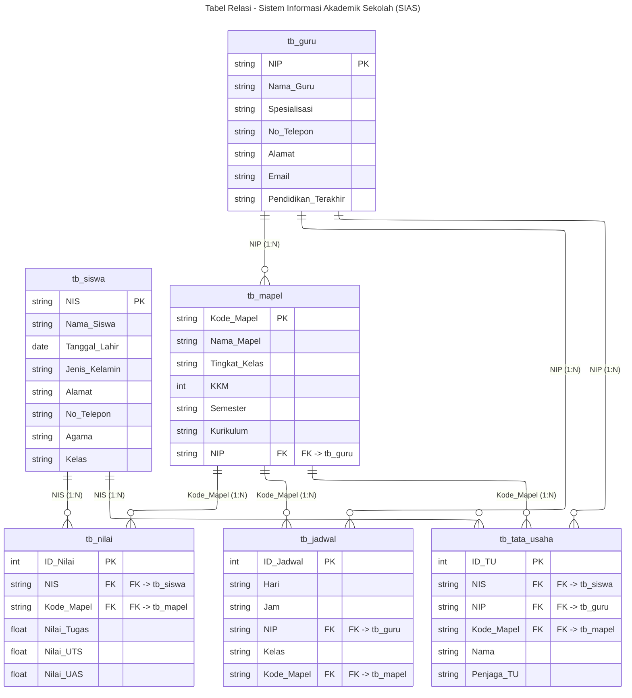

# Tabel Relasi - Sistem Informasi Akademik Sekolah (SIAS)

> **Kardinalitas:**
> - GURU (1) --- (N) MAPEL → 1 Guru mengajar banyak Mapel
> - SISWA (1) --- (N) NILAI → 1 Siswa punya banyak Nilai
> - MAPEL (1) --- (N) NILAI → 1 Mapel punya banyak Nilai
> - GURU (1) --- (N) JADWAL → 1 Guru punya banyak Jadwal
> - MAPEL (1) --- (N) JADWAL → 1 Mapel dijadwalkan banyak kali
> - TATA_USAHA → Junction/admin yang menghubungkan Siswa, Guru, Mapel
