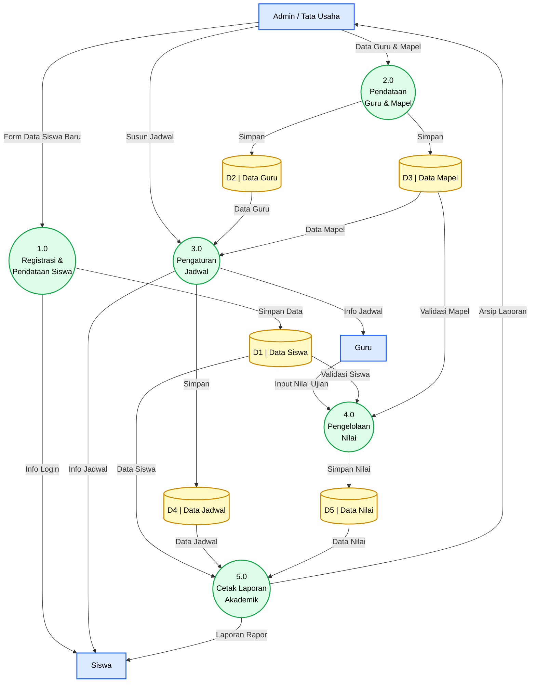

# DFD Level 1 - Sistem Informasi Akademik Sekolah (SIAS)

```mermaid
flowchart TD
    %% ── Entitas Eksternal ──
    Admin["Admin / Tata Usaha"]
    Siswa["Siswa"]
    Guru["Guru"]

    %% ── Proses ──
    P1(("1.0\nRegistrasi &\nPendataan Siswa"))
    P2(("2.0\nPendataan\nGuru & Mapel"))
    P3(("3.0\nPengaturan\nJadwal"))
    P4(("4.0\nPengelolaan\nNilai"))
    P5(("5.0\nCetak Laporan\nAkademik"))

    %% ── Data Store ──
    D1[("D1 | Data Siswa")]
    D2[("D2 | Data Guru")]
    D3[("D3 | Data Mapel")]
    D4[("D4 | Data Jadwal")]
    D5[("D5 | Data Nilai")]

    %% ── P1: Registrasi ──
    Admin -- "Form Data Siswa Baru" --> P1
    P1 -- "Simpan Data" --> D1
    P1 -- "Info Login" --> Siswa

    %% ── P2: Pendataan Guru & Mapel ──
    Admin -- "Data Guru & Mapel" --> P2
    P2 -- "Simpan" --> D2
    P2 -- "Simpan" --> D3

    %% ── P3: Pengaturan Jadwal ──
    Admin -- "Susun Jadwal" --> P3
    D2 -- "Data Guru" --> P3
    D3 -- "Data Mapel" --> P3
    P3 -- "Simpan" --> D4
    P3 -- "Info Jadwal" --> Siswa
    P3 -- "Info Jadwal" --> Guru

    %% ── P4: Pengelolaan Nilai ──
    Guru -- "Input Nilai Ujian" --> P4
    D1 -- "Validasi Siswa" --> P4
    D3 -- "Validasi Mapel" --> P4
    P4 -- "Simpan Nilai" --> D5

    %% ── P5: Cetak Laporan ──
    D1 -- "Data Siswa" --> P5
    D4 -- "Data Jadwal" --> P5
    D5 -- "Data Nilai" --> P5
    P5 -- "Laporan Rapor" --> Siswa
    P5 -- "Arsip Laporan" --> Admin

    %% ── Styling ──
    style Admin fill:#dbeafe,stroke:#2563eb,stroke-width:2px,color:#000
    style Siswa fill:#dbeafe,stroke:#2563eb,stroke-width:2px,color:#000
    style Guru fill:#dbeafe,stroke:#2563eb,stroke-width:2px,color:#000

    style P1 fill:#dcfce7,stroke:#16a34a,stroke-width:2px,color:#000
    style P2 fill:#dcfce7,stroke:#16a34a,stroke-width:2px,color:#000
    style P3 fill:#dcfce7,stroke:#16a34a,stroke-width:2px,color:#000
    style P4 fill:#dcfce7,stroke:#16a34a,stroke-width:2px,color:#000
    style P5 fill:#dcfce7,stroke:#16a34a,stroke-width:2px,color:#000

    style D1 fill:#fef9c3,stroke:#ca8a04,stroke-width:2px,color:#000
    style D2 fill:#fef9c3,stroke:#ca8a04,stroke-width:2px,color:#000
    style D3 fill:#fef9c3,stroke:#ca8a04,stroke-width:2px,color:#000
    style D4 fill:#fef9c3,stroke:#ca8a04,stroke-width:2px,color:#000
    style D5 fill:#fef9c3,stroke:#ca8a04,stroke-width:2px,color:#000
```
