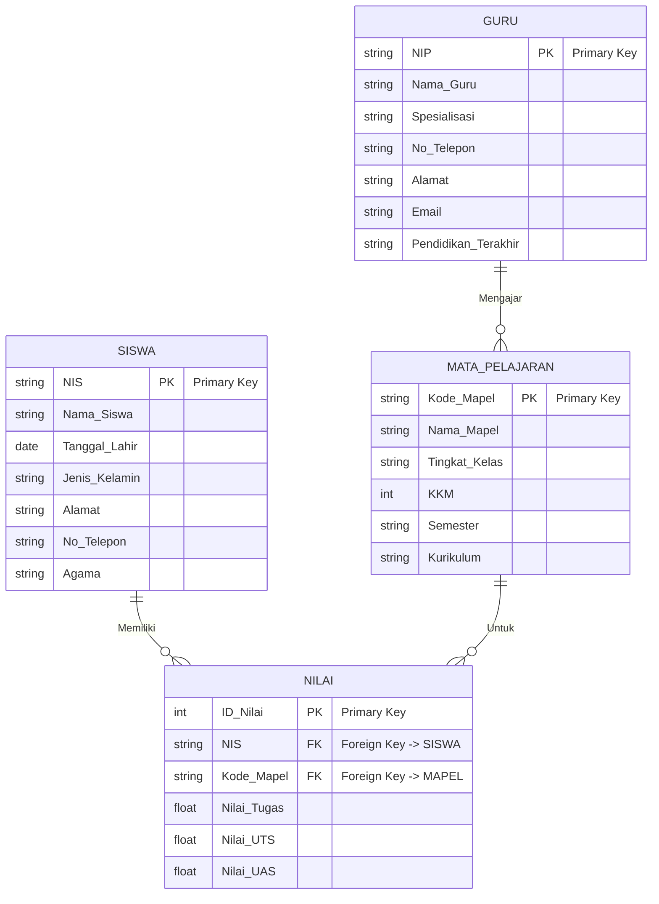

# ERD Banyak Relasi - Sistem Informasi Akademik Sekolah (SIAS)
> **Notasi: Yourdon & DeMarco (Chen-style ERD)**

> **Kardinalitas:**
> - GURU (1) --- (N) MATA_PELAJARAN → 1 Guru mengajar banyak Mapel
> - SISWA (M) --- (N) MATA_PELAJARAN → dipecah via tabel NILAI (Junction)
> - SISWA (1) --- (N) NILAI → 1 Siswa punya banyak Nilai
